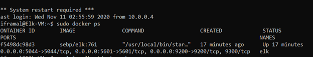

Automated ELK Stack Deployment
The files in this repository were used to configure the network depicted below.

These files have been tested and used to generate a live ELK deployment on Azure. They can be used to either recreate the entire deployment pictured above. Alternatively, select portions of the playbooks file may be used to install only certain pieces of it, such as Filebeat.

https://github.com/tiframal/Projects/tree/main/files

This document contains the following details:

Description of the Topology

Access Policies

ELK Configuration

Beats in Use

Machines Being Monitored

How to Use the Ansible Build

Description of the Topology

The main purpose of this network is to expose a load-balanced and monitored instance of DVWA, the D*mn Vulnerable Web Application.
Load balancing ensures that the application will be highly available, in addition to restricting access to the network.

Load balancers enable network traffic to be shared between two or more servers. This protects against distributed denial-of-service (DDoS) attacks. The advantage of using a jump box is that it allows admins to create a specific and highly secured machine to access and configure servers. 

Integrating an ELK server allows users to easily monitor the vulnerable VMs for changes to the log files and system metrics. Filebeat monitors files on the machine and generates log files for analysis through ElasticSearch, Logstash, and Kibana. Metricbeat is used to monitor system and service information such as CPU usage, memory, and load and also feeds data to ELK for analysis.

The configuration details of each machine may be found below. Elk VM has its own VNet and is in a separate availability zone than Web-1, Web-2, and Web-3. It can however be accessed through the Jump Box and is connected to the VNet for the other VMs using a Peering option.

| Name            | Function   | IP Address | Operating System |
|-----------------|------------|------------|------------------|
| Jump Box        | Gateway    | 10.0.0.4   | Linux            |
| Web-1 with DVWA | Web server | 10.0.0.6   | Linux            |
| Web-2 with DVWA | Web server | 10.0.0.7   | Linux            |
| Web-3 with DVWA | Web server | 10.0.0.8   | Linux            |
| Elk VM          | Monitoring | 10.1.0.4   | Linux            |

Access Policies

The machines on the internal network are not exposed to the public Internet. The machines allow initial connection from the Local Workstation as per the inbound rules for the network security groups. The Local Workstation is able to SSH into the Jump Box via its public IP, which is 40.79.37.97. The Jump Box can then SSH into the ELK machine and the three web servers. The Local Workstation can also access the web servers via HTTP over port 80. In addition, the ELK machine monitors the three web servers.

A summary of the access policies in place can be found in the table below.

|   Name   | Publicly Accessible | Allowed IP Addresses |
|:--------:|:-------------------:|:--------------------:|
| Jump Box | Yes                 | [REDACTED IP]        |
| Web-1    | No                  | 10.0.0.1-254         |
| Web-2    | No                  | 10.0.0.1-254         |
| Web-3    | No                  | 10.0.0.1-254         |
| ELK VM   | No                  | 10.0.0.1-254         |

Elk Configuration
Ansible was used to automate configuration of the ELK machine. No configuration was performed manually, which is advantageous because it allows admins to spend less time updating or configuring servers through the use of task automation.  

The playbook implements the following tasks:
1) Install Docker
3) Install pip3, which would enable the configuration of python packages
4) Download the Docker image
5) Increase the use of virtual memory
6) Download and launch the Docker ELK container

The following screenshot displays the result of running docker ps after successfully configuring the ELK instance.

Target Machines & Beats

This ELK server is configured to monitor the following machines:

1) Web-1 with DVWA: 10.0.0.6
2) Web-2 with DVWA: 10.0.0.7
3) Web-3 with DVWA: 10.0.0.8

We have installed the following Beats on these machines:
1) Filebeat
2) Metricbeat

These Beats allow us to collect the following information from each machine:
1) Filebeat monitors files and generates log files so that admins can monitor changes in file systems and within files themselves.
2) Metricbeat monitors system and service information such as CPU usage and memory. This enables admins to track changes in machine performance, which can occur be impacted when malicious software is installed. Metricbeat is also able to detect changes to sudo privileges. 

Using the Playbook
In order to use the Install-Elk playbook, you will need to have an Ansible control node already configured. Assuming you have such a control node provisioned:
SSH into the control node and follow the steps below:

1) Copy the Install-Elk playbook file to the correct folder (/etc/ansible). The "hosts" line in the playbook is used to ensure that packages are installed on the appropriate servers. 
2) Update the hosts file to include the host name (elk), the ansible python interpreter, and the IP addresses of the virtual machines (10.1.0.4). To ensure that the ELK server is running, go to http://40.79.37.97:5601/app/kibana (the IP address in the URL is the public IP address of the ELK server).
